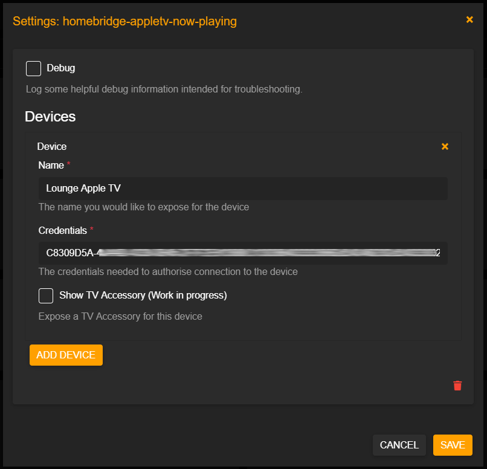
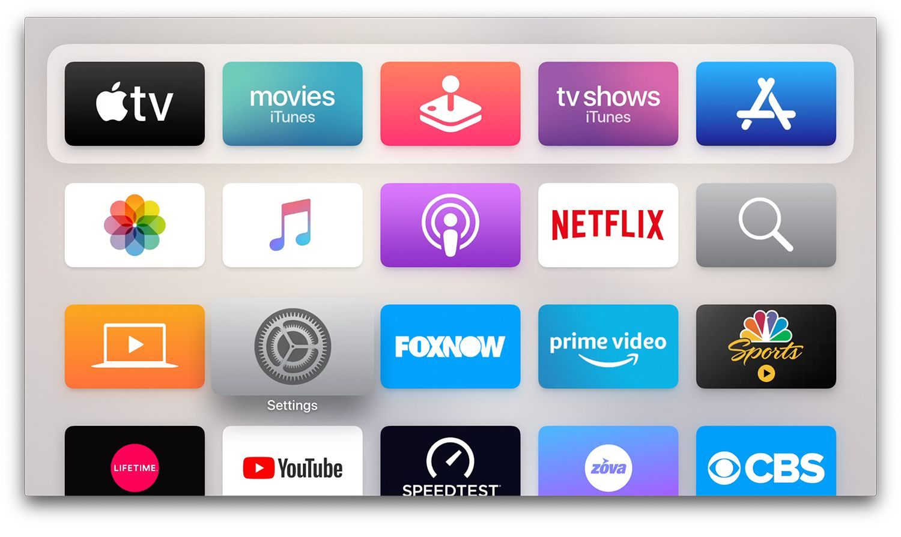

# Homebridge Apple TV - Now Playing

A [homebridge](https://github.com/nfarina/homebridge) plugin that exposes Apple TV devices to Homekit, along with it's current Power State, Playback State and Now Playing Information.

## Overview

This plugin exposes the Apple TV as a switch device, with the switch power state representing the Apple TV power state. The playback state is exposed through the Active charceristic and all other now playing information get's exposed through customised characteristics.

The media type is calculated by checking artist and album information. This characterist comes in handy if you would like to setup automations that dim light for only videos and not music.

**Note:** The now playing information are exposed as custom charactersitics, which means that the Apple Home App will not be able to read these. You will need to use an app such as [Home+ 4](https://apps.apple.com/us/app/home-4/id995994352) or [Eve for Homekit](https://apps.apple.com/us/app/eve-for-homekit/id917695792).

**Note:** The TV Accessory is an _experimental_ feature, so please use it expecting things to not work. 

  It launches apps by mimicking button presses to the location of the app on the home screen and selecting it. It seems to be working fairly well and is a good substitute for when / if true application launching is available. I am looking into how I might be able to get the currently launched application without the now playing info so that the input selection can be updated if it changes outside of the accessory.

## Configration

Configuration can be done using [Homebridge Config UI X](https://github.com/oznu/homebridge-config-ui-x).



## Sample Configuration

```yaml
{    
  "platform": "AppleTvNowPlayingPlatform",
  "debug": true, 
  "devices": [        
    {            
      "name": "Lounge Apple TV",            
      "credentials": "C8309D5A-4AAD-4338-8B45...."        
    }    
  ]
}
```
### Configuration Definition

* **platform**: The identifier for the platform (*AppleTvNowPlayingPlatform*).
* **debug** [*optional*]: Enables limited debugging.
* **devices**: A list of devices you would like to register with the platform.     
  * **name**: The name you would like to expose for the device.
  * **credentials**: The credentials needed to authorise connection to the device.
  * **showTvAccessory**: Expose a TV Accessory for the device.
  * **inputs**: A list of applications (shown as inputs) for the TV Accessory.
    * **name**: The application name.
    * **index**: The location (index) of the application on your Apple TV home screen. For example, Netflix is at index 9 in this screenshot. 

## Retrieving credentials

In order to retrieve credentials for your Apple TV, please follow these step

1. Execute the cli application bundled with this package from the package directory
```
/path/to/homebridge-appletv-now-playing $ node .\bin\cli.js
```
2. Choose the device with which you would like to pair.
3. Enter the PIN shown on your device.

**Example:**

```
/path/to/homebridge-appletv-now-playing $ node .\bin\cli.js

Scanning for devices...
These Apple TVs were found:

        1 : Lounge [C8309D5A-XXXX-XXXX-XXXX-2F7F2E813680]

Pair with Apple TV (enter index) : 1

Attempting to connect to Lounge [C8309D5A-XXXX-XXXX-XXXX-2F7F2E813680]...
Attempting to pair with Lounge [C8309D5A-XXXX-XXXX-XXXX-2F7F2E813680]...

Enter PIN shown on Lounge [C8309D5A-XXXX-XXXX-XXXX-2F7F2E813680] : 1234

Successfully paired with Lounge [C8309D5A-XXXX-XXXX-XXXX-2F7F2E813680].

Please update your configuration with the following credentials for this device:

C8309D5A-XXXX-XXXX-XXXX-2F7F2E813680:27y934hj523843kj2432423j4234kj23423kj4234j......
```
